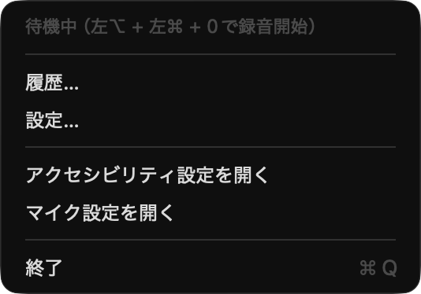

# koebun

**完全ローカルで動く、Mac 用の日本語音声入力アプリ。**

メニューバーに常駐し、ホットキー（既定は右 ⌥。設定で変更できます）を押すと録音を開始。もう一度押すと文字起こしして、そのとき最前面にあるアプリのカーソル位置へテキストを挿入します。音声もテキストも端末の外に出ません。サブスクもアカウント登録もありません。

**モデルのダウンロードは要りません。** 起動して権限を許可すれば、そのまま喋って挿入まで通ります（macOS 26 以降）。数GB のモデルが要るのは、認識を WhisperKit に替えたときだけです。



*メニューの 1 行目は、いま設定されているホットキーを表示します（画像は変更後の例。既定は 右 ⌥）。*

<!-- TODO: デモ GIF を docs/demo.gif に置いてここに貼る（録音 → 挿入まで）-->

---

## なぜ作ったか

前は Superwhisper を使っていました。不満らしい不満はなかったのですが、ひとつだけ引っかかることがありました。**喋り終えてから文字が出るまでに、毎回一瞬の待ちが入る。** AI が文章を整形している時間です。一回あたりは短くても、一日に何十回もやると気になってきます。

それで、ある時ふと考えました。**この整形、自分には要るんだろうか。**

自分が音声入力で書いているものは、ほとんどが Claude Code への指示です。渡す先が AI なら、「えーと」が残っていても、助詞が一つ違っていても、固有名詞が少し崩れていても、向こうが汲み取って動いてくれます。**整形は受け取る側が勝手にやってくれるのに、それを渡す手前でもう一度やって、その分だけ待っていた**ということになります。

整形が要らないなら、認識は Mac に最初から入っているもので足ります。実際に測ったら、macOS 内蔵の音声認識は **292ms** で、句読点まで付けて返ってきました（同じ発話で WhisperKit は 3,906ms。開発者の Mac 1 台で 1 回ずつ測った値です。詳しくは[後述](#既定をこの構成にした理由)）。モデルのダウンロードも要りません。押したら、待たずに、入る。

そうやって整形を外していくと、残るのは**入り口と出口**だけでした。いつ始めていつ終わるかを自分で決められること（ホットキーを押す・もう一度押す）、画面を見ずに録音中だと分かること（開始音・停止音）、「えーと」を気にせず喋れること（フィラー除去。これは LLM ではなく単なる文字列処理なので 0ms）、そしてカーソルの位置に確実に入って、入らなかったら必ず履歴に残ること。koebun はこれだけのアプリです。

認識エンジンでは何もしていません。既定は macOS 内蔵の SpeechAnalyzer をそのまま呼んでいるだけで、精度は Apple のものです。実は LLM 整形も一度は実装して持っていたのですが、使い続けても一度も必要にならなかったので、2,400 行ほど消しました。**薄いことがこのアプリの取り柄**だと思っています。

自分ひとりが毎日使うために作ったものです。同じところで引っかかっている人がいれば使えると思います。

### 似たアプリについて

公開する前に調べてみると、同じ方向のアプリはすでにたくさんありました。英語圏なら [VoiceInk](https://github.com/Beingpax/VoiceInk) や [Handy](https://github.com/cjpais/Handy)、日本語でも macOS 26 の SpeechAnalyzer を使ったものが、ちょうど同じ時期に何本も出ています（[nobetsu](https://github.com/pochang6/nobetsu)、[vox](https://github.com/MizuRyu/vox)、[whisperkun](https://github.com/m-tkg/whisperkun) など）。考えることはみんな同じなんだと思います。

機能の数で比べれば、どれも koebun よりたくさんのことができます。整形してほしい、話した端から入ってほしい、という人にはそちらのほうが合うはずです。Windows や Linux でも使いたいなら、Handy が対応しています。

それでも自分で作って使い続けているのは、音声入力の「入り口と出口」をどこまで削れるかを、自分の毎日の入力で確かめたかったからです。koebun は、その個人的な研究開発の置き場です。何を足して何を削ったかは、理由ごと [設計の根拠](docs/design-rationale.md) に残しています。

---

## いまできること / まだできないこと

### できること

- メニューバー常駐（Dock には出ません）
- ホットキーでトグル録音（既定は右 ⌥、設定で変更できます）— 押している間ではなく、押すたびに開始／停止
- 日本語の文字起こし。**既定は Apple の音声認識**（macOS 26 以降。OS 内蔵でダウンロード不要）で、設定から WhisperKit（Whisper large-v3-turbo）へ切り替えられます
- **辞書置換** — 文字起こし結果を機械的に置換（`アットマーク` → `@` など）。LLM を通さないので、同じ入力からは必ず同じ出力になります
- **フィラー除去** — 「えーと」「あの」などを決定的に取り除きます。LLM を通さないので遅延ゼロ。語彙は `~/koebun/fillers.json`
- **履歴** — 生テキスト・置換後・所要時間・使用エンジンを残し、後から読み返せます（保存期間は設定可能）
- 録音 HUD（声の大きさと経過時間だけの細いバー。マウスを乗せると停止・キャンセル）
- 最前面アプリのカーソル位置へ自動挿入（クリップボード経由。**元のクリップボードは復元されます**）。挿入できなかったときの結果の残し先は設定で選べます（HUD / クリップボード / 履歴だけ。どれでも履歴には残ります）
- **パスワード欄には入力しません** — パスワード欄と Secure Keyboard Entry 中は、送る前に止めて理由を出します（この経路では結果をクリップボードにも残しません）
- **メニューバーアイコンで状態が分かる** — 読込中（黄・砂時計）／待機（マイク）／録音中（赤・塗りつぶし）／処理中（青・波形）／完了（緑・チェック）／エラー（橙・警告）。色と形状の両方で区別でき、VoiceOver にも読ませています
- 録音の開始音／停止音をシステムサウンドから選択
- 録音トリガーキーの変更（右⌥／左⌥／右⌘／左⌘／右⌃／左⌃／右⇧／左⇧／fn。複数の修飾キーや通常キーとの組み合わせも可。例: 右⌥ + S、左⇧ + 左⌘ + 0）

### まだできないこと（実装予定）

| 機能 | 状態 |
|---|---|
| 署名済みバイナリの配布（Releases / Homebrew） | 未配布 |

**他ツールとの速度・精度の比較は書きません。** 「Superwhisper より速い／正確」といった主張は現時点で一切していません。

---

## ダウンロードは「必要になったときだけ」

koebun は**何も落とさない状態を出発点**にして、機能を足したぶんだけ容量を払う設計です。

| 構成 | 追加ダウンロード | いつ発生するか |
|---|---|---|
| **既定**（Apple 音声認識） | **0** | — |
| 音声認識を WhisperKit に切り替え | 約 630MB | 設定「一般 > 音声認識」で選んだとき |

初回だけで、2 回目以降はキャッシュを読むためオフラインでも動きます。

### 既定をこの構成にした理由

開発者の Mac 1 台で、同じ発話を 4 つの組み合わせに通して 1 回ずつ計測した結果です。**1 台 1 回の計測なので、あなたの環境で同じ数字が出るとは限りません。** 性能の主張ではなく、既定を決めた根拠として書いています。

- 音声認識は Apple が **292ms**、WhisperKit が **3,906ms** でした。しかも Apple 側は**句読点を自前で付けてくる**ので、整形の仕事の相当部分が認識の時点で済みます
- Apple の音声認識には弱点があります。英数字・URL・メールアドレスは 3 回とも別々の壊れ方をしました。**壊れ方が毎回違うので辞書置換では救えません。** ここが重要な用途では WhisperKit に切り替えてください（同じ発話で WhisperKit は両方とも正しく取れています）

かつては LLM 整形（Qwen3 / Apple Foundation Models）も持っていましたが、**実使用で一度も必要にならなかったので削除しました。** 認識側が句読点を付けてくるうえ、整形を挟むと 2.8 秒の待ちが増えます。経緯は [`docs/engine-benchmark.md`](docs/engine-benchmark.md) にあります。

---

## 完全ローカルであることの根拠

- **アプリのコードにネットワーク送信処理は存在しません。** `URLSession` / `URLRequest` / ソケット API のいずれも `Sources/` の Swift コードに含まれていません（`grep -rniE "URLSession|URLRequest|https?://|socket|dataTask" Sources/*.swift` で確認できます。ヒットは 0 件です）。
- **既定の構成では、アプリはモデルを 1 バイトも取得しません。** Apple の音声認識は OS のアセットを借りるだけです（日本語のアセットが Mac にまだ無い場合に限り、OS 自身がそれを取りに行くことがあります。アプリが持つモデルではありません）。
- **通信が発生するのは、自分で WhisperKit を選んだときだけです。** Hugging Face（`argmaxinc/whisperkit-coreml`）から CoreML モデルを取得します（`~/Library/Application Support/com.kenta3578.koebun/huggingface/models/argmaxinc/whisperkit-coreml/openai_whisper-large-v3-v20240930_turbo_632MB`、約 630MB）。初回だけで、2 回目以降はキャッシュを読むのでオフラインで動作します。
- **どちらの場合も、音声とテキストは送信されません。** 落ちてくるのはモデルの重みだけで、通信は一方向です。
- **落ちてきた重みは記録と照合します。** WhisperKit にはモデルの revision を固定する口が無く、Hugging Face の `main` を追い続けます。そこで全 22 ファイルの SHA-256 とサイズをリポジトリに固定してあり（`Sources/ModelIntegrity.swift`）、一致しなければモデルを使わずエラーにします。**期待値を Hugging Face から取りに行くことはしません**——検証したい相手から期待値を取っても意味が無いうえ、上の「通信処理が無い」という根拠が消えるためです。
- 文字起こし結果は、履歴を有効にしている間だけ `~/koebun/history/` に残ります（録音した音声はディスクに残しません）（保存期間は設定で変更でき、期限切れは自動で削除されます）。ほかにディスクに書くのは、自分で登録した置換ルール（`~/koebun/replacements.json`）、フィラー語（`~/koebun/fillers.json`）、取り込んだ音（`~/koebun/sounds/`）、設定値（`UserDefaults`）だけです。
- アプリのサンドボックスは OFF です。グローバルなキー監視（ホットキー）と ⌘V の合成送出に必要なためで、この判断は `project.yml` にコメントとして残しています。

---

## 必要環境

- **Apple Silicon の Mac**（Intel Mac は未検証）
- **macOS 26 以降**を推奨 — 既定の Apple 音声認識が動くのはこのバージョンからです
- **macOS 26 未満（14.0 以降）** でも動きます。この場合、既定は自動的に WhisperKit になるため、**初回に約 630MB のダウンロードと空きディスクが必要**です（設定画面の Apple 音声認識は選べない状態で表示されます）
- 空きディスク: 既定（macOS 26 以降）なら**追加で要りません**。WhisperKit なら約 3GB
- メモリ: 既定の構成ではアプリはモデルを常駐させません。WhisperKit を使うと数 GB を消費します。**動作確認は Apple Silicon の Mac 1 台のみ**で、最低メモリ要件は未検証です

---

## インストール

### 現在（署名済みバイナリは未配布）

Developer ID 証明書による署名と Apple の notarization がまだ行われていないため、GitHub Releases での `.dmg` 配布は行っていません。手順は [RELEASING.md](RELEASING.md) に文書化してあります。

**当面はソースからビルドしてください。** 手順は [BUILD.md](BUILD.md) にあります（概略）:

```bash
brew install xcodegen
git clone https://github.com/kenta3578/koebun.git
cd koebun
xcodegen generate
open koebun.xcodeproj   # Signing & Capabilities で自分の Personal Team を選んで ⌘R
```

### 将来（Releases 配布後）

`.dmg` をダウンロード → `koebun.app` を `/Applications` へドラッグ → 起動、で完結する予定です。

---

## 必要な権限

初回起動時に 2 つの権限が必要です。どちらもメニューバーアイコンのメニューから設定画面を直接開けます。

| 権限 | 用途 | 設定方法 |
|---|---|---|
| **マイク** | 録音 | 初回録音時にダイアログが出るので「許可」 |
| **アクセシビリティ** | ホットキーの監視と ⌘V の合成送出 | システム設定 > プライバシーとセキュリティ > アクセシビリティ で koebun を ON |

> **アクセシビリティを ON にしないと、ホットキーを押しても何も起きません。** ホットキーが無反応なときは、まずここを疑ってください。ビルドし直したあとは、いったん OFF → ON し直す必要がある場合があります。

---

## 使い方

1. アプリを起動すると、メニューバーにアイコンが出ます
2. 既定の構成なら、ほぼ待たずに待機（マイクのアイコン）になります。WhisperKit を選んでいる場合は、初回だけモデルのダウンロードとロードが走ります（黄色の砂時計）
3. テキストを入力したい場所にカーソルを置きます
4. **ホットキー（既定は右 ⌥）を押す** → 録音開始（開始音が鳴り、アイコンが赤いマイクに変わります）
5. 話し終えたら **もう一度押す** → 停止音が鳴り、文字起こしが走ります（青い波形）
6. 完了すると、カーソル位置にテキストが挿入されます（緑のチェック）

アイコンをクリックすると、状態が文字でも確認できます。エラーが起きたときは橙色の警告アイコンのまま止まるので、メニューを開けば原因が読めます。

---

## 設定

> **設定項目の全体像と「やりたいこと → どこを触る」の早見表は [docs/MANUAL.md](docs/MANUAL.md)（説明書）にまとめています。** 以下は概要です。

メニューバーアイコン > 「設定…」から変更できます。タブは「一般」「辞書置換」の 2 つ。

### 一般

- **音声認識エンジン** — 既定は Apple 音声認識（ダウンロード不要）。WhisperKit に切り替えると初回に約 630MB を取得します。切り替えると使わない方はメモリから降ります
- **録音開始音 / 録音停止音** — macOS のシステムサウンド（Glass, Basso, Ping など 14 種）または「なし」。選ぶとその場で試聴されます
- **録音 HUD** — 録音中の細いバー（最小／非表示）。非表示にすると開始音・停止音だけで状態を知らせます
- **録音トリガー** — 「変更」を押してから使いたい修飾キーを押すと、そのキーが登録されます

設定は `UserDefaults` に保存されます。**既定値を変えても、すでに保存されている選択は上書きされません**（このバージョンで既定が変わったのは、まだ一度も触っていない項目だけです）。

### 辞書置換

音声では入力しづらい記号や、音声認識が繰り返し間違える固有名詞を、置換ルールで直します。文字起こしの直後に適用されます。

初期ルールとして `アットマーク`→`@`、`ドットコム`→`.com`、`スラッシュ`→`/`、`シャープ`→`#`、`アンダースコア`→`_` が入っています。設定画面から追加・編集・削除でき、内容は **`~/koebun/replacements.json`** に保存されるので、エディタで直接編集したり Git で管理したりもできます。設定画面のパスをクリックすると開けて（右クリックで Finder に表示）、保存すれば再起動せずに反映されます。

```json
[
  { "from": "アットマーク", "to": "@" },
  { "from": "カーズ桜", "to": "河津桜" }
]
```

同じ形式の JSON ファイルは、設定画面の「ファイルから読み込む…」でまとめて追加できます。すでに同じ読みのルールがあればその行は飛ばし、既存のルールは変更しません。語彙セットはアプリに同梱せず、ファイルとして配布しています。

| 語彙セット | 内容 |
|---|---|
| [`presets/engineer.json`](presets/engineer.json) | 開発の話をするとき用。`プルリクエスト` / `プロリクエスト` / `プルリク`→`PR`、`イシュー`→`Issue`、`ギットハブ`→`GitHub` など |

置換は語の一部にも当たるので、語彙セットには一般の語の中に現れない読みだけを入れています（`Tests/ReplacementsTests.swift` で確認）。

置換は先頭から 1 パスで走査し、各位置で**最も長くマッチするルール**を 1 つだけ適用します。置換結果が別のルールに再マッチする連鎖が起きないので、ルールを並べる順番によって結果が変わることはありません。

---

## カスタマイズ（ソースから使う場合）

| 変えたいもの | 場所 |
|---|---|
| 各設定の既定値（音声認識エンジンなど） | `Sources/SettingsStore.swift` の `init()` |
| 使用する Whisper モデル（例: `large-v3` にして精度寄りに。約 2.9GB で認識は 2 倍ほど遅い） | `Sources/Transcriber.swift` の `WhisperKitConfig(model:)` |
| 文字起こしの言語（現在は `ja` 固定） | `Sources/Transcriber.swift` の `DecodingOptions(language:)` |
| 選択できる修飾キーの一覧 | `Sources/SettingsStore.swift` の `keyName(for:)` / `isKeyDown(keyCode:flags:)` |
| 辞書置換の初期ルール | `Sources/Replacements.swift` の `defaultRules`（既存ユーザーのルールは `~/koebun/replacements.json` が優先） |
| 挿入方式（現在はクリップボード + ⌘V 合成） | `Sources/TextInjector.swift` |
| WhisperKit のバージョン | `project.yml` の `packages.WhisperKit` |

依存の revision は `koebun.xcodeproj/project.xcworkspace/xcshareddata/swiftpm/Package.resolved` で固定しています（`.xcodeproj` 自体は XcodeGen で生成するため Git 管理外ですが、このファイルだけ例外的に追跡しています）。

---

## ロードマップ

設計の根拠は [`docs/design-rationale.md`](docs/design-rationale.md) にあります。

残っている大きなものは **署名済みバイナリの配布** です。ダウンロード不要で試せる既定にしたので、`.dmg` を配れば「落として起動して喋る」まで一直線になります。

明確に作らないもの: 会議録音・話者分離・iOS/Windows 版・多言語対応・クラウドモデル。

---

## ドキュメント

- [docs/MANUAL.md](docs/MANUAL.md) — 説明書（設定項目と「やりたいこと → どこを触る」）
- [docs/ARCHITECTURE.md](docs/ARCHITECTURE.md) — 中の作り（処理の流れ・ファイルの責務・状態機械・読む順番）
- [BUILD.md](BUILD.md) — ソースからのビルドと実行
- [RELEASING.md](RELEASING.md) — 署名・notarization・配布の手順
- [CLAUDE.md](CLAUDE.md) — このリポジトリで作業する AI エージェント向けの設計メモ

---

## ライセンス

MIT License. 詳細は [LICENSE](LICENSE) を参照してください。

音声認識には Apple の Speech フレームワーク（SpeechAnalyzer）と [WhisperKit](https://github.com/argmaxinc/WhisperKit)（MIT License, Argmax Inc.）を使用しています。
