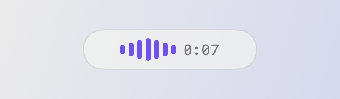
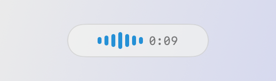
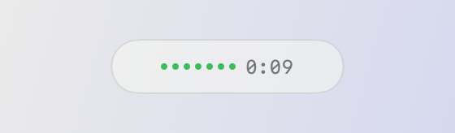

## 使い方は 3 つだけ

  

    
    1
    
文字を入れたい場所にカーソルを置いて、<b>右 ⌥</b> を押して話す。画面下の棒が声に合わせて動きます

  

  

    
    2
    
話し終えたら、もう一度 <b>右 ⌥</b>。棒が水色で止まり、文字起こしが始まります

  

  

    
    3
    
緑になったら、カーソルの位置に文字が入っています。辞書置換とフィラー除去は済んだ状態です

  

設定の画面や困ったときの見方は[説明書](/manual)にあります。

